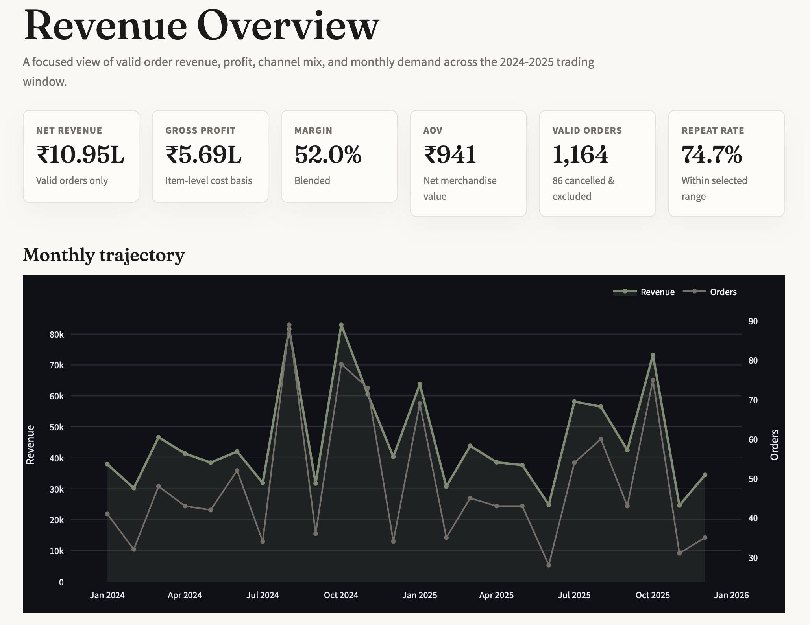
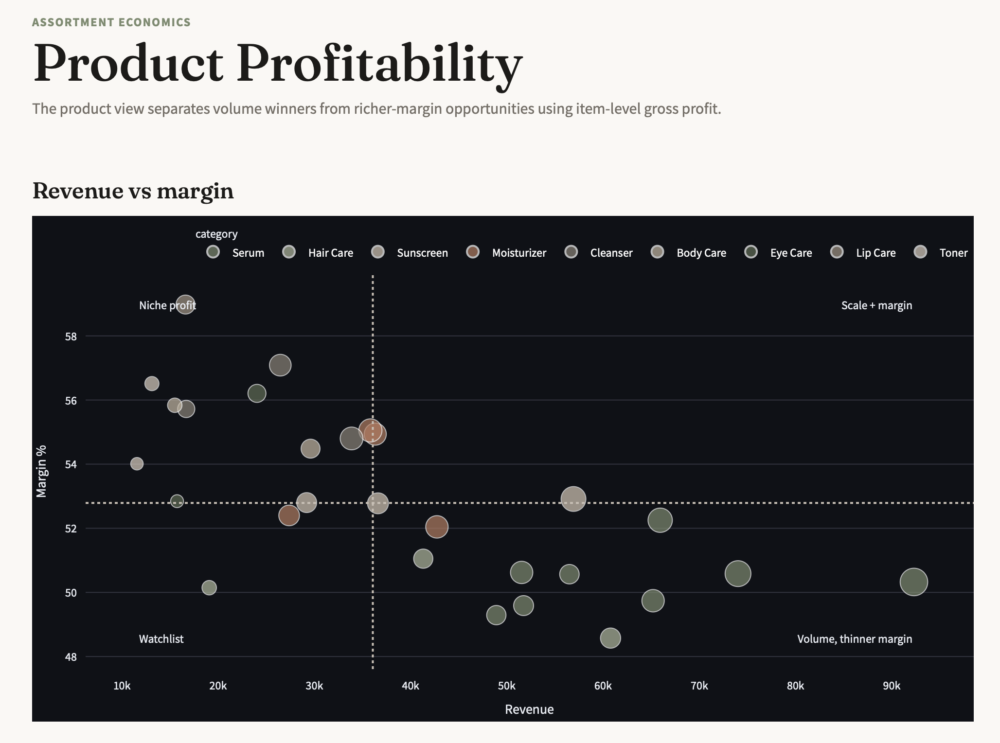

# D2C Skincare Analytics Dashboard

A polished multi-page analytics dashboard for a synthetic D2C skincare e-commerce brand. The app turns six relational CSV tables into executive-ready views for revenue, product profitability, returns, product quality, and customer segmentation.

Built with **Streamlit**, **pandas**, and **Plotly**.

## Dashboard Preview

### Revenue Overview



### Product Profitability



## Purpose

This project is designed as a business intelligence and analytics portfolio project. It demonstrates how raw e-commerce data can be cleaned, modeled, validated, and presented as a decision-ready dashboard.

The dashboard helps answer questions such as:

- How much valid-order revenue and gross profit did the brand generate?
- Which product categories and sales channels drive revenue?
- Which products combine high revenue with strong or weak margins?
- Which products show quality risk through high returns and low ratings?
- Which customer segments are most valuable based on RFM analysis?

## Key Features

- Multi-page Streamlit dashboard
- Cached data loading with `@st.cache_data`
- Clean pandas data model with joins and derived metrics
- Interactive Plotly charts
- Revenue, margin, AOV, repeat-rate, and return-rate KPIs
- Product-level revenue vs margin scatter plot
- Returns and review-quality risk analysis
- RFM segmentation for customer value analysis
- Cohort retention heatmap
- Minimal soft clinical luxury visual theme

## Pages

1. **Revenue Overview**  
   Tracks net revenue, gross profit, margin, AOV, valid orders, repeat rate, monthly trends, category revenue, and sales-channel mix.

2. **Product Profitability**  
   Highlights product economics using revenue, units sold, gross profit, and margin percentage.

3. **Returns & Product Quality**  
   Combines return reasons, refund status, rating distribution, and product quality-risk watchlists.

4. **Customers & RFM**  
   Segments customers into Champions, Loyal, Promising, and At Risk groups using recency, frequency, and monetary value.

## Project Structure

```text
skincare-dashboard/
├── app.py
├── data_loader.py
├── theme.py
├── requirements.txt
├── README.md
├── data/
│   ├── Customers.csv
│   ├── Orders.csv
│   ├── Order_Items.csv
│   ├── Products.csv
│   ├── Returns.csv
│   └── Reviews.csv
├── images/
│   ├── revenue-overview.png
│   └── product-profitability.png
└── pages/
    ├── 1_Revenue_Overview.py
    ├── 2_Product_Profitability.py
    ├── 3_Returns_and_Quality.py
    └── 4_Customers_and_RFM.py
```

## How To Run

Clone the repository:

```bash
git clone https://github.com/harshvardhan1322/D2C-Skincare-Analytics.git
cd D2C-Skincare-Analytics
```

Install dependencies:

```bash
python3 -m pip install -r requirements.txt
```

Run the dashboard:

```bash
python3 -m streamlit run app.py
```

Then open:

```text
http://localhost:8501
```

## Data

The app uses six CSV files in the `data/` folder:

- `Customers.csv`
- `Products.csv`
- `Orders.csv`
- `Order_Items.csv`
- `Returns.csv`
- `Reviews.csv`

The dataset is synthetic and intended for analytics, SQL, BI, and portfolio practice.

## Important Data Rules

- Cancelled orders are excluded from revenue, profit, AOV, order-count, and RFM metrics.
- `gross_amount` is treated as net merchandise value after item-level discounts.
- Gross profit is calculated at order-item level as:

```text
item_total - (cost_price * quantity)
```

- `delivered_date` blanks are expected for cancelled and in-transit orders.
- Acquisition-channel charts show revenue attribution only, not CAC or ROAS.
- `stock_qty` is treated as a static snapshot, not an inventory trend.

## Validation Metrics

The data pipeline reproduces these sanity-check numbers:

| Metric | Value |
|---|---:|
| Net revenue | ₹10,95,078 |
| Gross profit | ₹5,69,318 |
| Blended margin | 52.0% |
| Valid orders | 1,164 |
| AOV | ₹941 |
| Repeat-purchase rate | 74.7% |
| Return rate | 6.8% |
| Average review rating | 3.91 |

## Tech Stack

- Python
- Streamlit
- pandas
- Plotly

## Notes

This project is for educational and portfolio use. The dataset is synthetic and does not represent official company data.
